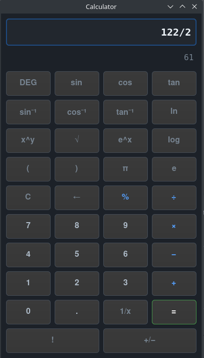
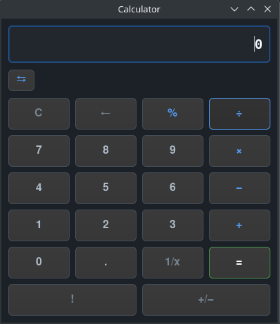
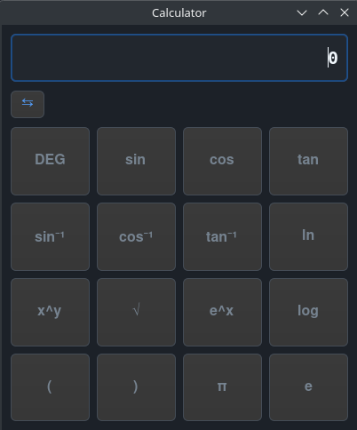

# MathEngine

<p align="center">
  
</p>

A scientific calculator implemented in C with GTK4 GUI. Originally intended as a clone of Google's calculator but evolved into a more comprehensive scientific calculator application.

[](https://en.cppreference.com/w/c)
[](https://www.gtk.org/)
[](http://www.throwtheswitch.org/unity)
[](LICENSE)
## User Interface

<p align="center">
  
  
  
</p>

## Features

- **Scientific Functions**:
  - Basic arithmetic operations (+, −, ×, ÷)
  - Trigonometric functions (sin, cos, tan) with DEG/RAD mode toggle
  - Inverse trigonometric functions (sin⁻¹, cos⁻¹, tan⁻¹)
  - Logarithmic functions (ln, log)
  - Exponential functions (e^x)
  - Square root (√), power (x^y), and factorial (!)
  - Constants (π, e)
  - Parentheses for complex expressions
  - Reciprocal (1/x) and negation (+/−)

- **Calculator Functions**:
  - Decimal point support
  - Percentage calculations
  - Clear (C) and backspace (←) functionality
  - Proper operator precedence and chaining

- **GUI Features**:
  - GTK4-based interface with responsive grid layout
  - Clean, functional design with color-coded buttons
  - Large monospace display for clear number visibility
  - Support for both keyboard input and button clicks

## Build Requirements & Installation

To build and run MathEngine, you need standard compilation tools and the GTK4 development libraries.

### Debian / Ubuntu
Install the required packages using `apt`:
```bash
sudo apt update
sudo apt install -y libgtk-4-dev build-essential pkg-config
```

### Arch Linux
Install the required packages using `pacman`:
```bash
sudo pacman -Syu gtk4 base-devel pkgconf
```

### Unity Test Framework (Required for Tests)
To compile and run the unit tests, the Unity C test framework must be installed. The project's build system expects it in `/usr/local/include/unity/`.

```bash
git clone https://github.com/ThrowTheSwitch/Unity.git
sudo mkdir -p /usr/local/include/unity
sudo cp Unity/src/unity.c Unity/src/unity.h Unity/src/unity_internals.h /usr/local/include/unity/
rm -rf Unity
```

## Building

```bash
cd src
make
```

## Running

```bash
./calculator
```

Or use the convenience target:

```bash
make run
```

## Testing

The project includes unit tests:

```bash
make test
```

## Project Structure

```
MathEngine/
├── LICENSE
├── README.md
├── images/
│   └── image.png                 - Screenshot of the calculator GUI
├── src/
│   ├── calculator/
│   ├── calculator.c              - Main GUI application and event handlers
│   ├── calculator_logic.c        - Core calculator computation logic
│   ├── calculator_logic.h        - Calculator logic header and data structures
│   ├── Makefile                  - Build configuration with GTK4 and math library support
│   └── test_calculator.c         - Unit tests for calculator logic
```

## Usage

1. Click number buttons to enter values
2. Click operator buttons (+, −, ×, ÷) to perform operations
3. Use scientific function buttons (sin, cos, tan, etc.) for advanced calculations
4. Press = to calculate the result
5. Use ← to delete the last digit
6. Use C to clear everything
7. Toggle between DEG and RAD modes using the DEG/RAD button
8. Use parentheses to group operations

## Technical Details

The calculator uses a stack-based expression evaluator that handles operator precedence correctly. The GUI is separated from the calculation logic, following a clean architectural pattern. 

## License

This project is licensed under the MIT License.

## Contributing

Feel free to submit issues or pull requests to improve the calculator functionality or user interface.
